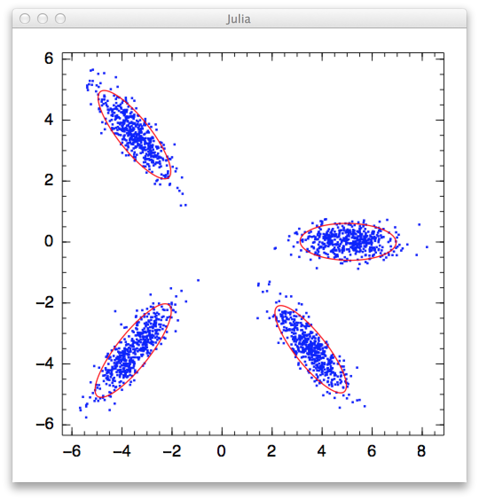

## MixtureModels.jl

A Julia package for probabilistic mixture models

A *mixture model* is a probabilistic model that combines multiple components to capture data distribution. Generally, a mixture model is characterized by a collection of components and a discrete distribution over them. From a generative perspective, the procedure to generate a sample from a mixture model consists of two steps: (1) choose a particular component from the discrete distribution, and (2) use the chosen component to generate the sample.


## Finite Mixture Model

*Finite mixture model* is a classical formulation of mixture model, which requires the number of components, often denoted by *K*, to be fixed before training. The *Expectation-Maximization (EM)* algorithm is usually used to estimate a mixture model from data.

#### Basic Usage

The function ``fit_fmm`` fits a mixture model to a given data set:

```julia
fit_fmm(C, data, K, alg)
```

Parameters:

* ``C``: the component type, e.g. one can use ``MultivariateNormal{PDMat}`` to indicate Gaussian components with full covariance matrix.
* ``data``: the input samples
* ``K``: the number of components to be estimated
* ``alg``: the algorithm option struct.

Here, ``alg`` can be constructed using the ``fmm_em`` function, as below

```julia
fmm_em(;
	maxiter::Integer=100,    # maximum number of iterations
	tol::Real=1.0e-6,        # tolerable change of objective value upon convergence
	display::Symbol=:none,   # can take value :none, :proc, or :iter
	alpha::Float64=1.0)      # Dirichlet prior coefficient for pi
```

This function returns a struct of type ``FiniteMixtureEMResults``, which contains the following fields:

* ``mixture``: an instance of type ``Mixture``, which has two fields: ``components`` (a list of components) and ``pi`` (component proportions);
* ``Q``: soft assignment matrix, of size ``(n, K)``. In particular, ``Q[i, k]`` indicates the probability that the i-th sample belongs to the k-th component;
* ``L``: likelihood matrix, of size ``(n, K)``. In particular, ``L[i, k]`` is the logpdf of the i-th sample w.r.t. the k-th component;
* ``niters``: the number of elapsed iterations;
* ``converged``: whether the procedure converged;
* ``objective``: the objective function value of the last iteration.

#### Examples

```julia
# train a Gaussian mixture model with 5 components, showing progress information at each iteration
r = fit_fmm(MultivariateNormal{PDMat}, x, 5, fmm_em(maxiter=50, display=:iter))

# print each component
for comp in r.components
    println(comp)
end

# If you are satisfied with default option values
r = fit_fmm(MultivariateNormal{PDMat}, x, 5, fmm_em())
```

**Note:**

In [*Distributions.jl*](https://github.com/JuliaStats/Distributions.jl), the type ``MultivariateNormal`` takes a type argument that specifies the form of covariance matrix. Specifically, ``MultivariateNormal{PDMat}`` uses full covariance, ``MultivariateNormal{PDiagMat}`` uses diagonal covariance, while ``MultivariateNormal{ScalMat}`` uses a covariance of the form ``s * I``. 

The package provides a demo in ``demo/gmm.jl`` to demonstrate the use of this package in fitting Gaussian mixture model. Below is a screenshot of the result:




#### Use User-supplied Q matrix


By default, this function initializes the soft assignment matrix ``Q`` randomly. The users can also provide their own version of initial Q-matrix, using the function ``fit_fmm!``:

```julia
fit_fmm!(C, data, Q, alg)
```
This function updates ``Q`` inplace. 


This package provides a convenient function ``qmatrix`` to construct ``Q``. For example, if you have a label vector ``labels``, which may be obtained by running a clustering algorithm, you can use this vector to construct ``Q``:

```julia
r = fit_fmm!(C, data, qmatrix(labels, K), alg)
```

Here, ``qmatrix`` constructs a matrix ``Q`` of size ``(n, K)`` such that ``Q[i, labels[i]] = 1.0`` and each row sums to one.


## Future Plan

* Implement variants of Finite Mixture Models
* Implement Bayesian Nonparametric Mixture Models (e.g. DPMM)
